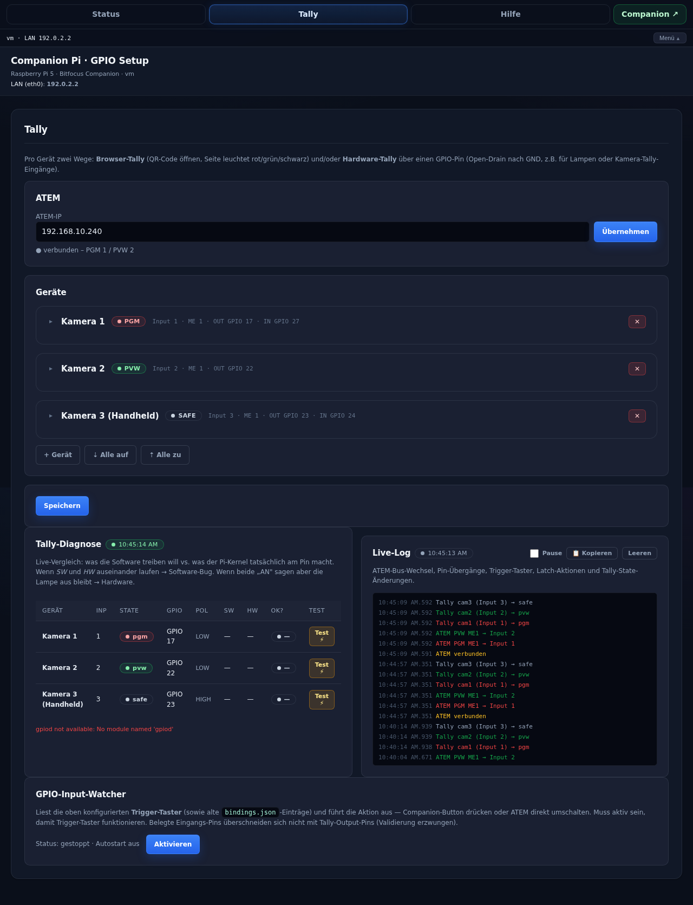
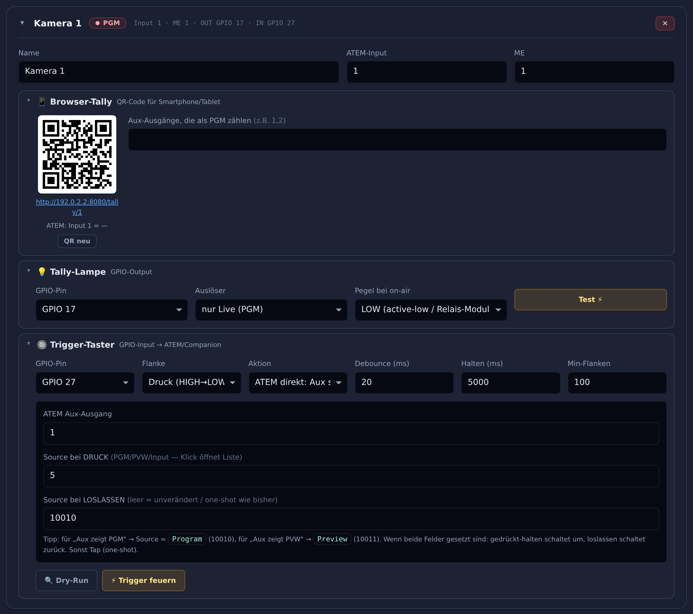
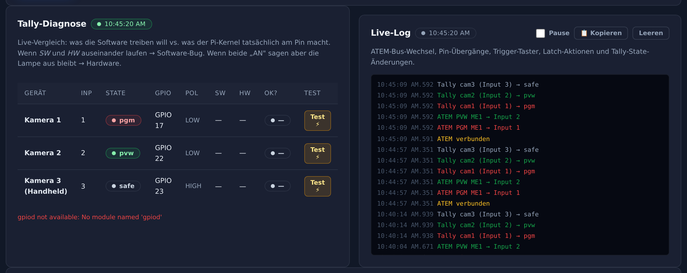

<div align="center">

# tally-pi

**ATEM tally lamps, browser tally and GPIO trigger buttons — on a Raspberry Pi.**

A self-contained broadcast appliance built on top of
[Bitfocus Companion](https://bitfocus.io/companion/): hardware tally lamps,
smartphone tally pages and physical trigger buttons, all configured from one
web UI. No build step, no cloud, no framework.

[](https://github.com/larszu/tally-pi/actions/workflows/syntax.yml)




</div>

## What it does

Turn a Pi with a 40-pin header, an HDMI screen and (optionally) an I²C OLED
into an ATEM controller. Per camera (or any ATEM source) you configure
**three independent functions**, freely combinable per device:

| | Function | What it gives you |
|---|---|---|
| 📱 | **Browser-Tally** | A QR-code URL any smartphone or tablet opens; the page paints itself red (PGM) / green (PVW) / black (safe) straight from live ATEM state — and amber, in words, whenever it can no longer vouch for what it shows. Optional beep and vibration when you go live. |
| 💡 | **Tally-Lampe** | The Pi watches your ATEM input and drives a GPIO pin. Polarity per device: active-LOW for opto-coupled relay modules, active-HIGH for a direct LED. |
| 🔘 | **Trigger-Taster** | A short-to-GND on a GPIO fires an action: set an ATEM Aux, switch PGM / PVW, or press a Companion button over its HTTP API. |

Each trigger has **press source + optional release source** (hold-to-switch
behaviour) and a software **burst tracker** that handles noisy inputs —
fibre-optic GPIO converters, long unshielded cables — by collapsing a flurry
of edges into one logical press and one release.

## Screenshots

Per-device configuration — the three functions stack inside one collapsible
card, with a live PGM/PVW/SAFE badge in the header:



Live diagnostics — what the software *wants* each pin to do next to what the
kernel actually reports, plus an event log you can copy straight into a bug
report:



The browser tally as it looks on a phone — full-bleed colour, source name
and bus label, nothing else to misread across a dark studio:

<p>
  
  
</p>

<sub>Captured by `docs/screenshots.py` — headless Chromium driving the real
`guide_server.py` against demo data (three cameras, a stubbed ATEM on
PGM 1 / PVW 2). The empty SW/HW columns and the `gpiod not available` note
in the diagnostics shot are expected: that host has no GPIO hardware. Run
the script yourself to regenerate them.</sub>

## Quick install — fresh Pi

Prerequisites: any Raspberry Pi 5 (Pi 4 also works) running either the
[Companion Pi image](https://github.com/bitfocus/companion-pi) **or**
plain Raspberry Pi OS with Companion installed at `/opt/companion/`. The
installer sets up the kiosk for the Pi's regular user — the account that
runs `sudo`, or the lowest-numbered UID ≥ 1000 when the script is piped
straight into root. Override with `TARGET_USER=<name>`.

One-shot install — pipe the bootstrap through `bash`:

```bash
curl -fsSL https://raw.githubusercontent.com/larszu/tally-pi/main/bootstrap.sh \
  | sudo bash
```

…or clone first if you want to inspect it:

```bash
git clone https://github.com/larszu/tally-pi.git
cd tally-pi
sudo bash bootstrap.sh
```

The installer:

1. Installs apt packages (X.org, Chromium, libgpiod, etc.).
2. Clones/updates this repo to `/opt/tally-pi`.
3. Enables I²C and HDMI safety flags in `/boot/firmware/config.txt`.
4. Deploys all Python services to `/opt/pi-guide` and `/opt/pi-status`.
5. Installs systemd units + udev rules.
6. Sets up tty1 autologin and Chromium kiosk via Openbox.
7. Enables and starts all watcher services.

Reboot **once** after the first install so the I²C kernel parameter
takes effect:

```bash
sudo reboot
```

Re-running `bootstrap.sh` is idempotent — it pulls `main` again, redeploys
files, and bounces the services. No reboot required for updates.

### Deploying a feature branch

```bash
curl -fsSL https://raw.githubusercontent.com/larszu/tally-pi/<branch>/bootstrap.sh \
  | sudo REPO_BRANCH=<branch> bash
```

### Local development → Pi (no GitHub round-trip)

From a working copy on your dev machine:

```bash
tar --exclude='.git' -czf tally-pi.tgz *
scp tally-pi.tgz <user>@<pi-ip>:/tmp/
ssh -tt <user>@<pi-ip> "cd /tmp && rm -rf tally-pi && mkdir tally-pi && \
  tar xzf tally-pi.tgz -C tally-pi && cd tally-pi && \
  echo '<sudo-password>' | sudo -S bash update-on-pi.sh"
```

`update-on-pi.sh` is a minimal re-deploy that just overwrites the runtime
files in `/opt/pi-guide` and restarts the four watcher services. No
package installs, no kiosk reconfig.

## After install

Three Chromium tabs open automatically on the connected HDMI screen:

- `http://<pi>:8080/` — **Setup Guide** (Status · Tally · Hilfe)
- `http://<pi>:8000/` — Companion UI
- `http://<pi>:8000/#/connections`

Exit kiosk with <kbd>Ctrl</kbd>+<kbd>Alt</kbd>+<kbd>Q</kbd>.

### Setting up tally + triggers

1. Open the **Tally** tab in the setup guide.
2. Enter your ATEM IP → *Übernehmen*. The status indicator turns green
   and the source autocomplete fills with your ATEM's input names.
3. Click **+ Gerät** to add a camera/source. Set name + ATEM-Input + ME.
4. Expand the blocks you need:
   - **📱 Browser-Tally** is always available; the QR code already works.
     Optionally list Aux outputs that should also count as PGM.

     The page never shows a reassuring colour it cannot back up. Red is PGM,
     green is PVW, near-black is safe — and those three are the *only* states
     that stay silent. Anything else is amber and says so in words:
     `MISCHER NICHT ERREICHBAR` (the Pi cannot see the mixer),
     `KEINE VERBINDUNG` (the page has heard nothing from the Pi for eight
     seconds), `KEINE AUSKUNFT` (the Pi does not know this device). The
     stream sends the state every three seconds even when nothing changes,
     so a connection that dies quietly — the normal failure of a phone on
     mobile data — is visible rather than frozen on the last colour.

     Tap **Ton aktivieren** once and the page beeps and vibrates the moment
     you go to PGM. Browsers only allow sound after a tap, so the button
     tells you whether it actually armed; a silent alarm you believe in is
     worse than none.

     > **Reach is your job, not the Pi's.** The page is served on the house
     > LAN. A contributor joining from somewhere else needs a tunnel or a VPN
     > you provide — this repo builds no relay and no cloud account.
   - **💡 Tally-Lampe** — pick a free GPIO pin and an *Auslöser* (PGM /
     PGM+PVW / manual) plus *Pegel bei on-air* (LOW for relay modules
     with opto-coupler input, HIGH for direct-LED + series resistor).
     *Test ⚡* latches the pin (click again to release).
   - **🔘 Trigger-Taster** — pick a GPIO pin and a *Flanke*. Then choose
     an *Aktion*:
     - **ATEM direkt: Aux/PGM/PVW setzen** — pick which bus, then enter
       the source (or pick from the dropdown — PGM and PVW are at the
       top of the list). Optional "Source bei LOSLASSEN" gives you
       hold-to-switch behaviour (Aux jumps to A while held, back to B
       on release).
     - **Companion-Button drücken** — pick Page/Row/Column and
       Tap (one-shot press) or Halten (down+up follow the physical
       switch).

     **For fibre-optic GPIO inputs** (or any noisy line):
     - Set *Halten (ms)* to 5000+ — the burst tracker collapses the
       fibre carrier's bursty edges into one stable press.
     - Set *Min-Flanken* to ≥100 to filter cross-coupling glitches.
5. Hit **Speichern**.

### Live diagnostics

The Tally tab also shows two live cards:

- **Tally-Diagnose** — side-by-side comparison of what the software
  *wants* each output pin to do vs. what the kernel reports the pin is
  currently doing. Helpful for sanity-checking wiring/polarity.
- **Live-Tally-Log** — all relevant events (ATEM bus changes,
  trigger-button presses, latch actions, pin transitions) with copy/
  clear buttons. Replaces the need to SSH into the Pi for debugging.

### Wiring notes

- **Output pin** drives 3.3 V CMOS (~16 mA sink). Two common setups:
  - Active-LOW relay module with opto-coupler input: pin → module-IN,
    module-VCC ≥ 3.3 V, module-GND ↔ Pi-GND. UI: *Pegel = LOW*.
  - Direct LED + series resistor (220–1 kΩ) to GND. UI: *Pegel = HIGH*.
- **Input pin** uses internal pull-up. Wire the button between the GPIO
  pin and any GND pin; pressing shorts to GND (idle = HIGH, pressed =
  LOW). For noisy/long lines: 100 nF MLCC across the button reduces
  bouncing; for fibre-optic GPIO links, use the burst tracker fields.
- The UI rejects unsafe pins (I²C / UART / SPI / EEPROM-reserved) and
  enforces disjoint pins between OUT and IN bindings.

## Components

| File | Role |
|---|---|
| `setup-guide.html` | Single-page setup-guide UI (served on `:8080`): Status, Tally, Hilfe. Vanilla HTML/CSS/JS — no build step, no framework. |
| `guide_server.py` | Python-stdlib HTTP server. Endpoints: `/ipconfig` `/gpio` `/numato` `/atem` `/bindings` `/tally-config` `/tally-out/<bcm>/(on\|off\|pulse\|latch-on\|latch-off\|release)` `/tally-diagnostics` `/input-test` `/service/pi-gpio-watcher` `/logs` + `/logs/stream` (SSE) + `/tally/{state,stream,<id>}`. Owns GPIO outputs via libgpiod 2.x. |
| `gpio_watcher.py` | libgpiod input watcher. Merges `tally.json` devices (with `in_gpio` set) and legacy `bindings.json`. Burst tracker for noisy inputs. Fires ATEM CAuS/CPgI/CPvI via the atem-watcher socket, or Companion HTTP API calls. |
| `atem_watcher.py` | Hand-rolled ATEM UDP client (no `pyatem` dep). Writes state to `/run/pi-guide/atem.json`. Listens on `/run/pi-guide/atem-cmd.sock` for JSON commands: `set_aux`, `set_program`, `set_preview`. |
| `numato_watcher.py` | Hot-plug watcher for Numato 32-CH USB GPIO modules via udev. |
| `pi_status.py` | OLED status cycler (luma.oled). Disabled by default; enable manually if an OLED is connected. |
| `pi-*.service` | systemd units for the watchers + the guide server + pi-status. |
| `99-numato.rules` | udev rule → stable `/dev/numato0` symlink for any Numato board. |
| `10-modesetting.conf` | Xorg fix for Pi 5 (pins `vc4` to modesetting driver). |
| `openbox-autostart` | Openbox autostart → Chromium with the three tabs. |
| `bootstrap.sh` | One-shot installer (fresh Pi or in-place update). |
| `update-on-pi.sh` | Minimal redeploy used by the tarball-scp dev workflow. |

## Configuration files

`/opt/pi-guide/tally.json` — owned by the setup-guide UI:

```json
{
  "atem_ip": "192.168.10.240",
  "devices": [
    {
      "id": "cam1",
      "name": "Kamera 1",
      "input": 1,
      "me": 1,
      "aux": [],

      "out_gpio": 17,
      "out_trigger": "pgm",
      "out_active_high": false,

      "in_gpio": 27,
      "in_edge": "falling",
      "in_debounce_ms": 20,
      "in_hold_release_ms": 5000,
      "in_burst_min_edges": 100,
      "in_action_type": "atem_aux",
      "in_atem_aux": 1,
      "in_atem_source": 5,
      "in_atem_source_release": 10010,
      "in_companion_mode": "tap"
    }
  ]
}
```

`/opt/pi-guide/bindings.json` — **legacy** GPIO-input bindings (still
read by `gpio_watcher.py` for back-compat). Prefer configuring inputs
through the Tally tab instead.

### Runtime state (written by the services, read by the UI)

| File | Writer | Reader | Purpose |
|---|---|---|---|
| `/run/pi-guide/atem.json` | atem_watcher | guide_server | ATEM PGM/PVW/Aux/inputs state |
| `/run/pi-guide/atem-cmd.sock` | atem_watcher | gpio_watcher, guide_server | UNIX socket for set_aux/set_program/set_preview |
| `/run/pi-guide/input-state.json` | gpio_watcher | guide_server | Burst-tracker pressed state per pin |
| `/opt/pi-guide/events.log` | guide_server, gpio_watcher | guide_server (live-log UI) | JSON-lines event log with rotation |

## Services

| Unit | Purpose | Default |
|---|---|---|
| `pi-guide.service` | Setup-Guide HTTP server + owns GPIO outputs. | enabled |
| `pi-gpio-watcher.service` | Watches input GPIOs, fires actions. | enabled |
| `pi-atem-watcher.service` | ATEM state reader + CAuS / CPgI / CPvI command sender. | enabled |
| `pi-numato-watcher.service` | Numato USB GPIO module poller. | enabled |
| `pi-status.service` | OLED status display. | disabled (enable manually) |
| `getty@tty1` | Auto-login + kiosk start. | enabled |

## Hardware

- **Target:** Raspberry Pi 5 (Debian 13 trixie, aarch64). Pi 4 also OK.
- **GPIO output (Tally-Lampe):** any pin from {4, 5, 6, 12, 13, 16, 17,
  18, 19, 20, 21, 22, 23, 24, 25, 26, 27}. Push-pull, sink ≤16 mA.
- **GPIO input (Trigger):** same allow-list. Internal pull-up; wire
  button between pin and any GND.
- **OLED (optional):** SSD1306 128×64 on I²C bus 1, address `0x3C`.

## Troubleshooting

If a trigger pin behaves erratically:

1. Open the **Live-Tally-Log** card (Tally tab) and watch press/release
   events. `[N edges]` in each release line shows how noisy the burst
   was. Real button presses produce 500–1000+ edges. Crosstalk glitches
   on fibre-link rigs typically have <20 edges — set `Min-Flanken` to a
   threshold safely above the largest glitch you see, well below the
   real-press count.
2. Use the **Trigger feuern** / **Dry-Run** buttons in the per-device
   trigger block to test the configured action without pressing the
   physical button.
3. The **Status** tab shows live pin levels and `sw_pressed` state from
   the burst tracker. A pin shown as "GEDRÜCKT" matches what the watcher
   considers "in press" state — which is what fires the ATEM action.

## License

Internal project. Not for redistribution.
