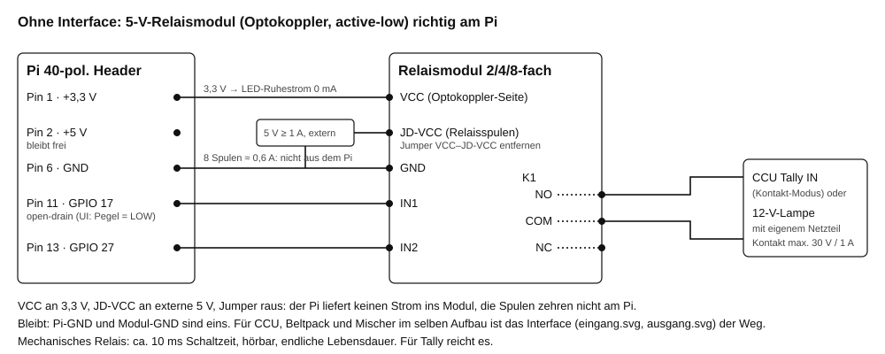
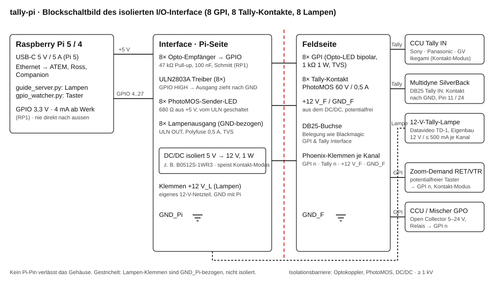
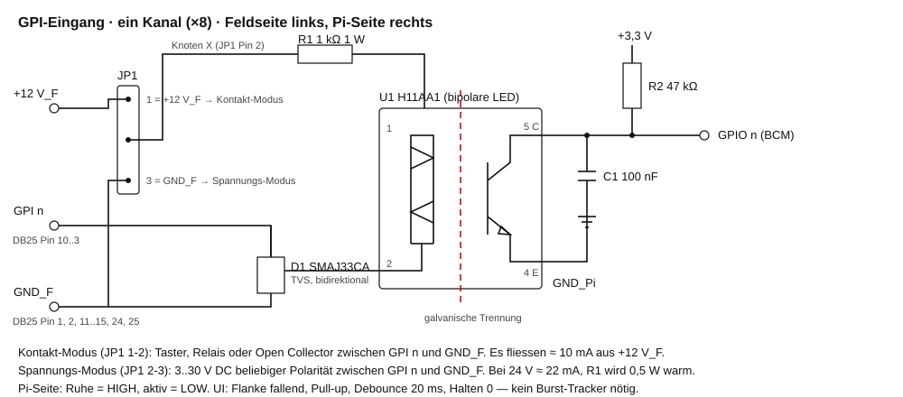
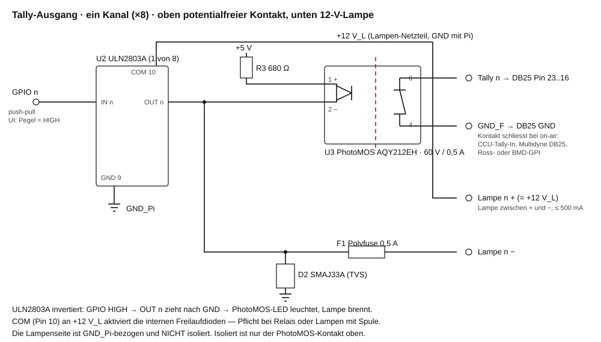

# Hardware und Verkabelung

Was der Pi elektrisch kann, was die Geräte am anderen Ende erwarten, und wie
beides zusammenkommt. Drei Stufen, jede für sich vollständig:

| Stufe | Wofür | Schaltplan |
|---|---|---|
| **A** LED oder Relaismodul direkt am Pi | Test, ein Mischer, eine Lampe, alles am selben Tisch | [relaismodul.svg](relaismodul.svg) |
| **B** Isoliertes I/O-Interface | CCU, Fiber-Beltpack, Mischer-GPI, 12-V-Lampen, Zoom-Demand-Taster | [blockschaltbild.svg](blockschaltbild.svg) · [eingang.svg](eingang.svg) · [ausgang.svg](ausgang.svg) |
| **C** Numato-USB-Board (Mac/Windows) | ohne Pi-Header | Abschnitt *Numato* |

## Was ein Pi-Pin kann

| | Pi 5 (RP1) | Pi 4 (BCM2711) |
|---|---|---|
| Pegel | 3,3 V | 3,3 V |
| Treiberstrom ab Werk | **4 mA** (DRIVE = 0x1; wählbar 2/4/8/12 mA) | 8 mA |
| Eingangs-Schmitt-Trigger | ab Werk **aktiv** | aktiv |
| interner Pull-up | ≈ 50 kΩ | ≈ 50 kΩ |
| 5 V am Eingang | nicht zulässig; unversorgt max. 3,63 V | nicht zulässig |
| Summe aller Pins | einige zehn mA | 50 mA |

Quelle: RP1 Peripherals Datasheet, Register `GPIO*_PAD` (DRIVE, SCHMITT, IE),
<https://datasheets.raspberrypi.com/rp1/rp1-peripherals.pdf>.

Daraus folgen die vier Regeln, auf denen alles Weitere steht:

1. **Kein Pi-Pin verlässt das Gehäuse.** Nach aussen gehen Kontakte
   (PhotoMOS, Relais) oder Open-Drain-Treiber, nach innen kommen Optokoppler.
2. **Ein Pin liefert höchstens 4 mA.** Eine LED mit 220 Ω zieht 6 mA, ein
   Relaismodul-Optokoppler 2–3 mA. Alles darüber bekommt eine Treiberstufe.
3. **Nie 5 V an einen Pin.** Auch nicht über die Optokoppler-LED eines
   5-V-Relaismoduls (siehe Stufe A).
4. **Massen bleiben getrennt**, sobald ein zweites Gerät mit eigener
   Versorgung im Spiel ist. CCU, Beltpack-Basis und Mischer liegen
   praktisch immer auf verschiedenen Potentialen.

## Wie die Software treibt

`guide_server.py` wählt die Treiberart je Ausgang aus der Polarität des
Geräts (`out_active_high`) — die Regel ist `tally_ausgang_treiber()`:

| UI *Pegel bei on-air* | Treiber | Ruhe | On-air | Passt zu |
|---|---|---|---|---|
| **LOW** (`out_active_high: false`) | open-drain | hochohmig, wie offener Kontakt | nach GND gezogen | Relaismodul mit Optokoppler, jeder Eingang, der „Schluss nach GND" will |
| **HIGH** (`out_active_high: true`) | push-pull | 0 V | +3,3 V, liefert Strom | LED + Vorwiderstand, ULN2803-Eingang, Stufe B |

Bei open-drain liefert der Pin nie Strom nach aussen. Liest der Kernel dort
trotzdem einen Pegel, den die Software nicht gesetzt hat, schreibt der
Server `pin_extern_gehalten` ins Ereignis-Log statt ihn mit `pinctrl`
zu überschreiben: dann hält etwas von aussen die Leitung, und das ist eine
Frage an die Verkabelung, nicht an den Kernel.

Eingänge (`gpio_watcher.py`) laufen mit internem Pull-up, Ruhe = HIGH,
gedrückt = LOW. Mit der Beschaltung aus Stufe B reicht das Kernel-Debounce
(20 ms); *Halten (ms)* bleibt 0 und der Burst-Tracker bleibt aus. Er ist für
Leitungen gedacht, die ohne Schutzbeschaltung hunderte Flanken je Druck
liefern — mit Optokoppler, 47 kΩ und 100 nF gibt es die nicht mehr.

## Stufe A — Relaismodul oder LED direkt am Pi

Die üblichen 2/4/8-fach-Relaismodule haben einen Optokoppler je Kanal, dessen
LED zwischen `VCC` und `IN` liegt, und einen Jumper `VCC–JD-VCC`, der die
Relaisspulen aus derselben Versorgung speist. Richtig am Pi:

| Modul | Pi | Warum |
|---|---|---|
| `VCC` | Pin 1 · **+3,3 V** | Die Optokoppler-LED sieht im Ruhezustand 3,3 V gegen 3,3 V: 0 mA, kein Glimmen, keine Rückspeisung. |
| `JD-VCC` | **externes 5-V-Netzteil ≥ 1 A**, Jumper entfernt | Eine Spule zieht 70–90 mA; acht Spulen aus dem Pi-5-V-Pin lassen den Pi einbrechen. |
| `GND` | Pin 6 · GND, und GND des 5-V-Netzteils | eine gemeinsame Masse |
| `IN n` | ein Pin aus der Allow-Liste | UI: *Pegel = LOW* → open-drain |

Der Relaiskontakt (`NO`/`COM`) ist potentialfrei und darf 30 V / 1 A. Er
schliesst den Tally-Eingang einer CCU im Kontakt-Modus oder schaltet eine
12-V-Lampe mit **eigenem** Netzteil. Was bleibt: Pi-Masse und Modul-Masse
sind eins; für den Aufbau mit CCU und Beltpack ist das Stufe B.

**LED direkt:** Vorwiderstand ≥ 470 Ω (3,3 V, rote LED 1,8 V → 3 mA),
UI: *Pegel = HIGH* → push-pull. 220 Ω sind mit dem Pi 5 zu viel.

**Taster direkt:** zwischen Pin und GND, 100 nF parallel zum Taster, Kabel
kurz. Für lange Leitungen, Zoom-Demands und Fiber-Wandler: Stufe B.

## Stufe B — isoliertes I/O-Interface

Acht GPI, acht potentialfreie Tally-Kontakte, acht GND-bezogene
12-V-Lampenausgänge. Die Feldseite ist über Optokoppler, PhotoMOS und einen
isolierten DC/DC-Wandler vom Pi getrennt. Belegung der DB25-Buchse wie beim
Blackmagic GPI & Tally Interface, damit vorhandene Kabel passen.

### Eingang (GPI), ein Kanal

| Bauteil | Wert | Aufgabe |
|---|---|---|
| U1 | H11AA1 (oder LTV-814, PS2805-1) | Optokoppler mit **bipolarer** LED: beide Polaritäten, kein Verpolschutz nötig |
| R1 | 1 kΩ, 1 W | LED-Strom: 10 mA bei 12 V, 22 mA bei 24 V (0,5 W), 2 mA bei 3,3 V |
| D1 | SMAJ33CA | bidirektionale TVS, ESD und Überspannung an der Klemme |
| JP1 | 3-pol. Jumper | **1-2 Kontakt-Modus**: +12 V_F liegt über R1 an, der Taster schliesst GPI n nach GND_F. **2-3 Spannungs-Modus**: 3..30 V DC von aussen zwischen GPI n und GND_F |
| R2 | 47 kΩ | Pull-up am Pi-Pin, Ruhe = HIGH |
| C1 | 100 nF | mit R2 ≈ 5 ms; der RP1-Schmitt-Trigger macht daraus eine saubere Flanke |

Was da hineingeht:

- **Zoom-Demand RET/VTR** (Fujinon, Canon): potentialfreie Taster mit eigenem
  Common. Am 12-pol. Demand-Stecker liegen `RET`/`RET Common` und
  `VTR`/`VTR Common` getrennt; am Objektivstecker der Kamera schalten sie
  gegen Masse (Pin 3), Pin 6 führt unregelte +12 V.
  Kontakt-Modus, Taster zwischen GPI n und GND_F. **Nie** die Kamera-Masse
  mit dem Pi verbinden — genau dafür ist der Optokoppler da.
- **Mischer-GPO** (Ross Carbonite: Kontakte 24 VAC/40 VDC, 120 mA; Blackmagic
  GPI & Tally Interface: Relais 30 V/1 A): Kontakt-Modus.
- **CCU-Tally-Ausgänge** (Panasonic AK-UCU600: Open Collector 12 V/100 mA;
  AW-RP150: Open Collector 24 V/50 mA): Kontakt-Modus, Open Collector zieht
  GPI n nach GND_F. GND_F an die Masse der CCU — die Isolation liegt zwischen
  Feldseite und Pi, nicht zwischen den Kanälen.
- **Fremde Tally-Spannung** (CCU im „POWER"-Modus, 12–24 V): Spannungs-Modus.

### Ausgang (Tally), ein Kanal

| Bauteil | Wert | Aufgabe |
|---|---|---|
| U2 | ULN2803A | 8 Darlington-Treiber, Eingang 3,3-V-tauglich (< 1 mA je Pin), Ausgang 50 V / 500 mA, Freilaufdioden nach `COM` |
| U3 | PhotoMOS AQY212EH (60 V / 0,5 A) | potentialfreier Kontakt, lautlos, ohne Verschleiss; alternativ ein 5-V-Relais am ULN-Ausgang |
| R3 | 680 Ω aus +5 V | ≈ 4 mA für die PhotoMOS-LED |
| F1 | Polyfuse 0,5 A | Lampenausgang selbstheilend abgesichert |
| D2 | SMAJ33A | TVS am Lampenausgang |
| +12 V_L | externes 12-V-Netzteil | Lampen. `COM` (ULN Pin 10) an +12 V_L, sonst sind die Freilaufdioden wirkungslos |

Der ULN2803A **invertiert**: GPIO HIGH → Ausgang zieht nach GND → Kontakt
schliesst, Lampe brennt. In der UI ist jedes Gerät an diesem Interface
*Pegel = HIGH* (push-pull), egal ob Kontakt oder Lampe.

Der **Kontakt** (Klemmen `Tally n`/`GND_F`, DB25) bedient alle Eingänge, die
„Schluss nach GND" erwarten:

| Ziel | Anschluss | Quelle |
|---|---|---|
| Multidyne SilverBack V Basis | DB25 „Intercom/GPIO": Pin 11 Red Tally In, Pin 24 Green Tally In, GND Pin 3/8/9/12/13/16/21/25 | [Manual S. 57](https://www.multidyne.com/uploads/products/manual/Silverback%20V%20Configuration%20and%20Operations%20Manual_v4_03-05-24.pdf) |
| Sony HDCU-1000…4300, HXCU | D-Sub 25 „Intercom/Tally/PGM": Pin 11/12 R Tally In X/Y, 24/25 G Tally In X/Y; CCU-Menü auf **CONTACT** | [CVP-Übersicht](https://cvp.com/pdf/sony-system-cameras---connections-of-ccus-connector-details.pdf) |
| Sony CCU-D50 | D-Sub 15: Pin 3 R Tally In, Pin 10 G Tally, Pin 2 GND | [Manual](https://www.manualslib.com/manual/159764/Sony-Ccu-D50.html?page=22) |
| Panasonic AK-UCU600/HCU250 | D-Sub 25: Pin 11/12 R Tally In H/C, 24/25 G Tally In H/C, 22/23 Yellow; Menü **MAKE** (intern 5 V / 2,2 kΩ) | [Manual S. 143](https://pro-av.panasonic.net/manual/html/AK-UCU600P_PS_E_ES(DVQP1734XA)_E/AK-UCU600P_PS_E_ES(DVQP1734XA)_E.pdf) |
| Panasonic AW-UE150 | RJ45 RS-422: Pin 2 R_Tally_In gegen Pin 1 GND; **keine Spannung anlegen** | [Manual S. 17](https://eu.connect.panasonic.com/sites/default/files/media/document/2025-01/AW-UE150%20Operating%20Manual.pdf) |
| Panasonic AW-RP150 | D-Sub 25 „Tally/GPIO 1": Pin 1–5 und 14–18 R_Tally_In 1–10, GND Pin 6/22/25 | [Manual S. 96](https://eu.connect.panasonic.com/sites/default/files/media/document/2018-12/180827_AW-RP150G_Operations(DVQP1819ZA)_E_1545047494.2321.PDF) |
| Grass Valley XCU UXF/Universe | SubD-15 „Signalling": Pin 4 On-Air In / 12 Return, Pin 3 ISO In / 11 Return; Menü **dry contact** | [User Guide Kap. 7.6](https://www.gravitymedia.com/wp-content/uploads/2022/04/Grass-Valley-UXF-Universe-User-Guide.pdf) |
| Ikegami CCU-890 | Tajimi 7-pol: A R Tally(+), B G Tally(+), C/D Tally(−); DIP auf **MAKE** | [Manual S. 55](http://www.s-pro.tv/upload/iblock/CCU-890.pdf) |
| Ross Carbonite GPI | DB37, 5-V-Logik, Pin nach GND ziehen | [Ross Help](https://help.rossvideo.com/carbonite-01/Topics/Specs/GPI.html) |
| Blackmagic GPI & Tally Interface GPI | DB25 Pin 3–10, Optokoppler nach GND, 5 V / 14 mA | [Pinout](https://www.spectratech.gr/Web/Blackmagic/pdf/GPI-and-Tally-Interface.pdf) |

Die **Lampe** (Klemmen `Lampe n +`/`−`) ist für 12-V-Tally-Leuchten bis
500 mA: Datavideo TD-1 (12 V / 100 mA), Eigenbau-LED-Leuchten, die Tally-
Lampe am Multidyne-Beltpack (HD15 Pin 15 liefert dort selbst +12 V / 1 A —
dann den Kontakt nehmen, nicht die Lampe).

### DB25-Belegung (Feldseite)

Wie Blackmagic GPI & Tally Interface, damit Kabel und Adapter passen:

| Pin | Funktion | Pin | Funktion |
|---|---|---|---|
| 3 | GPI 8 | 16 | Tally 8 |
| 4 | GPI 7 | 17 | Tally 7 |
| 5 | GPI 6 | 18 | Tally 6 |
| 6 | GPI 5 | 19 | Tally 5 |
| 7 | GPI 4 | 20 | Tally 4 |
| 8 | GPI 3 | 21 | Tally 3 |
| 9 | GPI 2 | 22 | Tally 2 |
| 10 | GPI 1 | 23 | Tally 1 |
| 1, 2, 11–15, 24, 25 | GND_F | | |

Alle GPI und alle Tally-Kontakte teilen sich GND_F. Isoliert ist die
Feldseite gegen den Pi, nicht Kanal gegen Kanal. Wer Kanäle gegeneinander
trennen muss (zwei CCUs mit verschiedenen Massen), nimmt die
Phoenix-Klemmen und je Kanal ein eigenes Optokoppler-Paar.

### Versorgung

| Schiene | Quelle | Verbraucher |
|---|---|---|
| +5 V Pi | USB-C-Netzteil (Pi 5: 5 V / 5 A) | Pi, ULN-Logik, PhotoMOS-LEDs, DC/DC-Eingang (< 300 mA gesamt) |
| +12 V_F | DC/DC 5 → 12 V isoliert, 1 W (B0512S-1WR3) | Kontakt-Modus der Eingänge, ≤ 80 mA |
| +12 V_L | eigenes 12-V-Netzteil, Masse mit Pi | Lampen, bis 8 × 500 mA |

Schirm der DB25 auf das Gehäuse, nicht auf GND_F.

### Stückliste (8 Kanäle)

| Anz. | Bauteil |
|---|---|
| 8 | H11AA1 (DIP-6) |
| 1 | ULN2803A (DIP-18) |
| 8 | AQY212EH PhotoMOS |
| 8 | 1 kΩ 1 W · 8 × 47 kΩ · 8 × 680 Ω |
| 8 | 100 nF MLCC |
| 8 | SMAJ33CA · 8 × SMAJ33A |
| 8 | Polyfuse 0,5 A (z. B. RXEF050) |
| 1 | B0512S-1WR3 DC/DC |
| 8 | 3-pol. Jumper + Steckbrücke |
| 1 | DB25-Buchse; 32 Phoenix-Klemmen 3,5 mm |
| 1 | 40-pol. Stapelleiste (HAT) oder 40-pol. Flachkabel |

## Stufe C — Numato USB GPIO

Das 32-Kanal-Board arbeitet mit 3,3-V-TTL und ist **kein gleichmässiges
Raster** (Quelle: [Numato-Doku](https://numato.com/docs/32-channel-usb-gpio-module-with-analog-inputs/)):

| Kanäle | Treiberstrom |
|---|---|
| IO0–IO7, IO16–IO20 | **2 mA** — kein Relaismodul, keine LED |
| IO8–IO15 | 25 mA |
| IO21–IO31 | 8 mA |

- Tally-Ausgänge auf **IO8–IO15** legen. `numato_watcher.py` meldet einen
  Ausgang auf einem 2-mA-Kanal als Hinweis in `numato.json`, die UI zeigt ihn.
- Eingänge haben **keinen** internen Pull-up: 4,7 kΩ von IO nach VCC (3,3 V),
  Taster gegen GND. Ohne Widerstand schwimmt der Eingang und meldet Phantom-Drücke.
- Ein Numato-Ausgang ist immer push-pull 3,3 V; für Relaismodule dieselbe
  Verdrahtung wie Stufe A (VCC 3,3 V, JD-VCC extern), für CCU und Beltpack
  Stufe B mit den Numato-Kanälen statt der Pi-Pins.

## Belegung der Pi-Pins

Frei für Tally und Taster: BCM 4, 5, 6, 12, 13, 16–27. Nicht verwenden:
0/1 (EEPROM), 2/3 (I²C, OLED), 7–11 (SPI), 14/15 (UART). Die UI erzwingt das.

## Quellen

- RP1 Peripherals Datasheet: <https://datasheets.raspberrypi.com/rp1/rp1-peripherals.pdf>
- Numato 32-Channel USB GPIO: <https://numato.com/docs/32-channel-usb-gpio-module-with-analog-inputs/>
- Blackmagic GPI & Tally Interface Pinout: <https://www.spectratech.gr/Web/Blackmagic/pdf/GPI-and-Tally-Interface.pdf>
- Riedel NSA-002A (Vorbild für GPI-Werte 5–30 V, 100 V Isolation): <https://www.cpl.tech/wp-content/uploads/2019/02/Riedel-Bolero-NSA-002A-User-Guide.pdf>
- Fujinon/Canon Zoom-Demand-Pinout: <http://www.3alitytechnica.com/support/documents/TECHGUIDES/SPC7000_Pinout.pdf>
- Übersicht CCU-Tally-Eingänge (Metasetz TLC-6S): <https://metasetz.com/downloads/TLC-6S_Preliminary.pdf>
